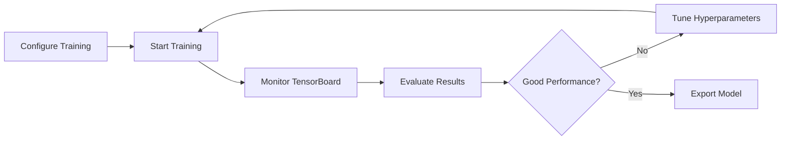
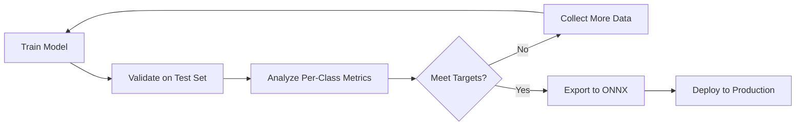

# HVAC AI Model Training

This directory contains the training pipeline, notebooks, and documentation for HVAC blueprint analysis models using YOLO11 segmentation.

## 📁 Directory Structure

```
ai_model/
├── notebooks/                          # Training notebooks
│   ├── YOLOplan_pipeline_optimized.ipynb    # ⭐ Recommended training pipeline
│   ├── YOLOplan_pipeline.ipynb              # Original pipeline
│   ├── YOLOplan_pipeline1.ipynb             # Variant
│   ├── auto_labeling_pipeline.ipynb         # Auto-annotation tools
│   ├── hvac_inference_yolo.ipynb            # Inference examples
│   ├── PIPELINE_COMPARISON.md               # Comparison of pipelines
│   └── old/                                 # Legacy notebooks
├── datasets/                           # Training datasets (not in repo)
├── TRAINING_GUIDE.md                   # 📚 Complete training guide
├── OPTIMIZATION_GUIDE.md               # 🚀 Performance optimization guide
└── README.md                           # This file
```

## 🚀 Quick Start

### For Google Colab Training

1. **Open the optimized pipeline:**
   - Navigate to `notebooks/YOLOplan_pipeline_optimized.ipynb`
   - Open in Google Colab
   - Set runtime to GPU (T4 or better)

2. **Add Colab secrets:**
   - `ROBOFLOW_API_KEY`: Your Roboflow API key
   - `RF_WORKSPACE`: Your workspace ID
   - `RF_PROJECT`: Your project ID
   - `RF_VERSION`: Dataset version number

3. **Run all cells** and monitor training progress

### Expected Results

With default configuration (1000 images, 100 epochs):
- **Training Time**: ~4 hours on T4 GPU
- **mAP50**: 0.85-0.90
- **mAP50-95**: 0.65-0.75
- **Inference Speed**: 30 FPS on T4

## 📚 Documentation

### Essential Reading

1. **[TRAINING_GUIDE.md](TRAINING_GUIDE.md)** - Start here!
   - Quick start instructions
   - Pipeline architecture
   - Training configuration
   - Monitoring and evaluation
   - Troubleshooting

2. **[OPTIMIZATION_GUIDE.md](OPTIMIZATION_GUIDE.md)** - For advanced users
   - Performance optimization
   - Hyperparameter tuning
   - Hardware-specific configs
   - Advanced techniques

3. **[PIPELINE_COMPARISON.md](notebooks/PIPELINE_COMPARISON.md)** - Compare pipelines
   - Feature comparison
   - Performance benchmarks
   - Migration guide

### Quick Reference

#### Notebooks Overview

| Notebook | Purpose | Recommended |
|----------|---------|-------------|
| `YOLOplan_pipeline_optimized.ipynb` | Production training with monitoring | ✅ Yes |
| `YOLOplan_pipeline.ipynb` | Original baseline | ⚠️ Legacy |
| `auto_labeling_pipeline.ipynb` | Auto-generate polygon annotations | ✅ Yes |
| `hvac_inference_yolo.ipynb` | Test trained models | ✅ Yes |

#### Training Configurations

**Small Dataset** (<500 images):
```yaml
model: yolo11s-seg.pt
imgsz: 1024
batch: 4
epochs: 100
patience: 15
```

**Medium Dataset** (500-2000 images):
```yaml
model: yolo11m-seg.pt
imgsz: 1024
batch: 4
epochs: 100
patience: 20
```

**Large Dataset** (>2000 images):
```yaml
model: yolo11l-seg.pt
imgsz: 1280
batch: 8
epochs: 150
patience: 30
```

## 🎯 Training Workflow

### 1. Data Preparation


**Tools:**
- Roboflow for annotation
- `auto_labeling_pipeline.ipynb` for synthetic data
- Built-in dataset validation in optimized pipeline

### 2. Training



**Best Practices:**
- Start with default configuration
- Monitor training curves in TensorBoard
- Validate on test set
- Iterate based on per-class performance

### 3. Evaluation and Deployment



## 🔧 Configuration Management

### YAML-Based Configs

The optimized pipeline uses YAML for configuration:

```yaml
# training_config.yaml
metadata:
  created_at: "2024-12-18"
  description: "Production HVAC training"

paths:
  project_dir: "/content/drive/MyDrive/hvac_project"
  run_name: "hvac_yolo11m_v1"

model:
  architecture: "yolo11m-seg.pt"

hardware:
  imgsz: 1024
  batch: 4
  amp: True

training:
  epochs: 100
  lr0: 0.001
  optimizer: "AdamW"

augmentation:
  mosaic: 1.0
  copy_paste: 0.3
  degrees: 10.0
```

### Version Control

Always commit configuration files:
```bash
git add training_config.yaml
git commit -m "Training config for run_v1"
```

## 📊 Performance Targets

### Production-Ready Thresholds

| Metric | Minimum | Target | Excellent |
|--------|---------|--------|-----------|
| mAP50 | 0.75 | 0.85 | 0.92+ |
| mAP50-95 | 0.50 | 0.65 | 0.75+ |
| Precision | 0.75 | 0.85 | 0.90+ |
| Recall | 0.70 | 0.80 | 0.90+ |
| FPS (T4) | 20 | 30 | 50+ |

### Per-Class Requirements

- **Critical** (valves, sensors): mAP50 > 0.85
- **Common** (pipes, ducts): mAP50 > 0.80
- **Rare** classes: mAP50 > 0.70

## 🐛 Troubleshooting

### Common Issues

#### 1. OOM (Out of Memory)
```yaml
# Solution: Reduce resources
batch: 2
imgsz: 640
workers: 1
```

#### 2. Low mAP
```yaml
# Solution: More training
epochs: 150
lr0: 0.002
copy_paste: 0.5
```

#### 3. Class Imbalance
- Collect more examples (50+ per class)
- Increase `copy_paste` augmentation
- Check annotation quality

#### 4. Training Instability
```yaml
# Solution: Stabilize training
lr0: 0.0001
warmup_epochs: 5
batch: 2
```

See [TRAINING_GUIDE.md](TRAINING_GUIDE.md) for detailed troubleshooting.

## 💡 Tips & Best Practices

### Data Quality
- ✅ Consistent annotation style
- ✅ Tight polygon bounds
- ✅ >50 examples per class
- ✅ Multiple blueprint styles

### Training Strategy
- ✅ Start with yolo11s (fastest)
- ✅ Use default config first
- ✅ Save checkpoints to Drive
- ✅ Monitor in TensorBoard

### Optimization
- ✅ Use learning rate warmup
- ✅ Enable mixed precision (AMP)
- ✅ Apply appropriate augmentation
- ✅ Validate on diverse test set

### Deployment
- ✅ Export to ONNX format
- ✅ Test on production data
- ✅ Document model version
- ✅ Monitor inference performance

## 🔬 Advanced Topics

### Hyperparameter Tuning

Use systematic approach:
1. Baseline with defaults
2. Learning rate sweep
3. Augmentation tuning
4. Architecture comparison

### Multi-GPU Training

For DGX or multi-GPU systems:
```python
model.train(
    device=[0,1,2,3],
    batch=16,  # 4 per GPU
)
```

### Model Ensembling

Combine multiple models for best accuracy:
```python
models = [
    YOLO('run1/best.pt'),
    YOLO('run2/best.pt'),
]
# Average predictions
```

### Active Learning

Iteratively improve dataset:
1. Train on initial data
2. Predict on unlabeled pool
3. Label most uncertain examples
4. Retrain and repeat

## 📈 Metrics and Monitoring

### TensorBoard Integration

Access during training:
```python
%load_ext tensorboard
%tensorboard --logdir {project_dir}
```

**Key Metrics:**
- Training/validation loss
- mAP progression
- Precision/Recall curves
- Learning rate schedule
- Sample predictions

### Post-Training Analysis

Review these metrics:
- Overall mAP50 and mAP50-95
- Per-class performance
- Confusion matrix
- Precision-Recall curves
- Speed benchmarks

## 🚢 Deployment

### Export Model

```python
# ONNX for production
model.export(
    format='onnx',
    imgsz=1024,
    optimize=True
)

# TensorRT for NVIDIA GPUs
model.export(
    format='engine',
    imgsz=1024,
    half=True
)
```

### Integration Example

```python
from ultralytics import YOLO

# Load exported model
model = YOLO('best.onnx')

# Run inference
results = model.predict(
    'blueprint.jpg',
    conf=0.25,
    iou=0.45
)

# Process results
for result in results:
    boxes = result.boxes
    masks = result.masks
    # Use detections...
```

## 📝 Changelog

### Version 1.0 (2024-12-18)
- ✨ Added optimized training pipeline
- ✨ Implemented learning rate scheduling
- ✨ Added YAML configuration management
- ✨ Integrated TensorBoard monitoring
- ✨ Added comprehensive evaluation
- ✨ Created ONNX export workflow
- 📚 Comprehensive documentation
- 📚 Training and optimization guides

## 🤝 Contributing

### Reporting Issues

Found a problem? Create an issue with:
- Description of the problem
- Steps to reproduce
- Expected vs actual behavior
- Environment details (GPU, Colab version)

### Improvements

To contribute improvements:
1. Test new techniques
2. Document results
3. Update configuration examples
4. Submit PR with findings

## 📞 Support

- **Documentation**: Start with [TRAINING_GUIDE.md](TRAINING_GUIDE.md)
- **Issues**: Check [OPTIMIZATION_GUIDE.md](OPTIMIZATION_GUIDE.md) troubleshooting
- **Questions**: Review [PIPELINE_COMPARISON.md](notebooks/PIPELINE_COMPARISON.md)

## 🔗 Resources

### External Documentation
- [Ultralytics YOLOv11](https://docs.ultralytics.com/)
- [YOLOplan Repository](https://github.com/DynMEP/YOLOplan)
- [Roboflow Docs](https://docs.roboflow.com/)

### Internal Documentation
- [HVAC Refactoring Guide](../docs/HVAC_REFACTORING_GUIDE.md)
- [System Architecture](../docs/adr/)
- [Development Roadmap](../docs/future/roadmap_hvac_development.md)

## 📜 License

This project follows the main repository license. See [LICENSE](../LICENSE) for details.

---

**Last Updated**: 2024-12-18  
**Version**: 1.0  
**Maintainers**: HVAC-AI Team

**Next Steps:**
1. Read the [TRAINING_GUIDE.md](TRAINING_GUIDE.md)
2. Open `YOLOplan_pipeline_optimized.ipynb`
3. Start training!
